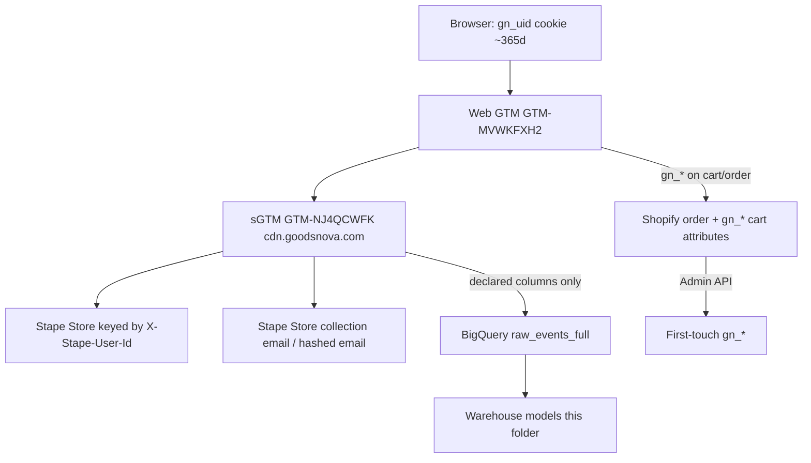

# LEGACY — DO NOT RUN IN PRODUCTION

The SQL in this folder is the **pre-policy_v1 warehouse sketch**. It is not the
canonical attribution pipeline.

Do **not** run:
- `07_dim_attribution_settings.sql` (would overwrite policy settings)
- `08_fct_attribution.sql` (30-day / last_paid / Direct-excluded linear)
- `02_dim_channel_rules.sql`
- `05_fct_touchpoints.sql` (dropped Real Direct)
- `06_fct_orders.sql` (event value labeled net_revenue)
- `09_marts.sql` / `14_qa.sql`

Those files now no-op with `DO_NOT_RUN`.

Canonical path:

1. `bigquery/migrations/2026_08_18_001_attribution_policy.sql`
2. `bigquery/migrations/2026_08_18_005_canonical_attribution_credit_fix.sql` (forward fix after 002)
3. App runtime: `src/lib/warehouse/sql.ts` + `getCanonicalAttributedOrders()`

---

# GoodsNova attribution warehouse


Production-grade, transaction-safe attribution on first-party server data.
This layer does **not** replace Shopify `gn_*` first-touch on `/attribution`.
Warehouse models are labeled **observed click / session attribution**. They are
not Meta or Google view-through, and they are not Ads Manager numbers.

## What exists (audited 2026-08-13)

Project: `stape-analytics-487802`

| Object | Type | Role |
|---|---|---|
| `stape_data.raw_events` | table | Skinny (event_name, transaction_id, value, currency, client_id). 70k+ rows. No dates/URLs. Do not use for attribution. |
| `stape_data.raw_events_full` | table | Immutable raw feed. Partitioned by `_PARTITIONTIME`, clustered by `event_name, transaction_id`. **60-day partition expiration.** |
| `stape_data.dashboard_events` | view | GA4-preferred view over `raw_events_full`. **Expires 2026-10-11.** Dashboard funnel still reads this. |
| `stape_shopify_dashboard.stape_events` | table | Test table. Has `fbclid` column but **0% fill**. Do not use. |

`raw_events_full` has **no JSON blob**. Only declared columns exist. GTM variables
that are not columns are **not** in BigQuery.

### Field matrix (`raw_events_full`, 2,298 rows, 2026-08-12 → 2026-08-13)

| Field | In BQ? | Fill | Notes |
|---|---|---|---|
| event_name | yes | 2289 / 2298 | page_view, view_item, purchase, shopify_order, … |
| event_id | yes | 945 | **0% on GA4**. Present on Data Client. |
| timestamp | yes | 2298 | millis |
| source_client | yes | 2286 | `GA4` (1307), `Data Client` (979), null (12) |
| transaction_id | yes | 34 | 17 unique purchases × 2 clients. `shopify_order` has **0**. |
| X-Stape-User-Id / stape_user_id | **no** | 0 | Not a column. Not in page_location. |
| gn_uid | **no** | 0 | Lives on Shopify order `gn_*` attributes, not in this feed. |
| shopify_customer_id | via `user_id` | 18 | Numeric Shopify customer id. **Data Client purchase only** (17/17). GA4 purchase 0/17. |
| user_id | yes | 18 | Same as Shopify customer id when present. |
| email_address | **no** | 0 | Do not add plaintext email to marts. |
| hashed_email | **no** | 0 | Need `{{Hashed - Email}}` on the writer. |
| client_id | yes | 2289 | GA4 hashed id ≠ Data Client `dcid.*`. Different pixels, same order. |
| session_id | `ga_session_id` | 1308 | **GA4 only**. Data Client 0%. |
| session_number | `ga_session_number` | 1308 | GA4 only. No `session_start` events. |
| page_location | yes | 2253 | UTMs and fbclid live **in the URL**, not columns. |
| page_referrer | yes | 1790 | |
| utm_* columns | **no** | URL only | utm_source in URL: 1341 events |
| gclid column | yes | **0** | URL gclid also 0 |
| gbraid / wbraid / dclid | yes | **0** | |
| fbclid column | **no** | URL 1269 | Dashboard currently `CAST(NULL AS fbclid)` even if a column existed |
| msclkid / ttclid | **no** | URL 0 | |
| value / currency / items | yes | purchases + ecommerce | |
| fb_first_click / google_first_click | **no** | Stape Store only | |
| session_count / purchase_count | **no** | Stape Store only | |
| is_new_customer | **no** | | |

Purchase copies: every `transaction_id` has exactly **two** `purchase` rows
(GA4 + Data Client). Never sum them. `Purchase_New_Customer` /
`Purchase_Return_Customer` are **not** in this table yet.

`shopify_order` (36 Data Client rows): no transaction_id, no value, no URL.
Not an order fact.

## Identity architecture (current)



Layers (do not collapse):

1. **X-Stape-User-Id** — anonymous Stape visitor. Stape Store document id. **Not in BQ today.**
2. **Known person** — hashed email + Shopify `user_id`. Email hash **not in BQ**. `user_id` on Data Client purchase only.
3. **gn_uid** — first-party browser id on Shopify orders. **Not in BQ events.**

Click IDs are attribution keys, not person keys. No IP merges.

## What will change / what will not

| Change | Why |
|---|---|
| New SQL in `bigquery/analytics/` | Layered warehouse. Raw tables untouched. |
| Dashboard `/warehouse` | Multi-model + quality. Does not alter First-touch (`gn_*`). |
| sGTM BigQuery writer **appends** columns | See `GTM_CHANGES.md`. Do not replace X-Stape-User-Id. |
| Do **not** drop `dashboard_events` | Funnel still uses it. Recreate before 2026-10-11 expiry. |
| Do **not** shorten `raw_events_full` retention further | 60-day expiry already limits lookbacks. |

Service account used by this app is **BigQuery Job User + Data Viewer** only.
It cannot `CREATE DATASET` / `CREATE VIEW`. Run the SQL in this folder as a
project Editor when ready. Until then the Next.js warehouse page runs the same
logic as **on-the-fly SELECT** against `raw_events_full`.

## Layer map

```
RAW          stape_data.raw_events_full          immutable
STAGING      analytics.stg_events                one row per server event, raw_* preserved
IDENTITY     analytics.identity_edges            deterministic co-occurrence only
             analytics.dim_person
SESSIONS     analytics.fct_sessions              GA4 session_id, else 30-min gap
TOUCHPOINTS  analytics.fct_touchpoints           not every page_view
ORDERS       analytics.fct_orders                1 row per transaction_id
ATTRIBUTION  analytics.fct_attribution           order × model × credited touch
MARTS        analytics.mart_*                    dashboard grain
```

## Order source precedence

For conflicting `purchase` rows with the same `transaction_id`:

1. Data Client (has `user_id`)
2. GA4
3. Ignore `shopify_order`
4. Ignore `Purchase_New_Customer` / `Purchase_Return_Customer` as extra revenue

## Attribution vs platform vs Shopify gn_*

| Series | Meaning |
|---|---|
| Shopify `gn_*` | Storefront first-touch on the order. Source of truth for First-touch. |
| Warehouse models | Deterministic click/session path in sGTM → BigQuery. |
| Platform-reported | Ads Manager. `platform_reported_*` only. Never mixed into warehouse credit. |

No view-through: we do not have impressions.

## Migration (does not break production GTM)

1. Audit (done).
2. Append columns on the **existing** BigQuery tag (additive). Old rows stay NULL.
3. Create `analytics` dataset and run `00`–`14` in order (Editor).
4. Point `/warehouse` at views when they exist (`WAREHOUSE_DATASET=analytics`).
5. Keep web GTM, sGTM, Stape Store keys, and `dashboard_events` as they are.
6. After GTM append, re-run QA in `14_qa.sql`.
7. Compare warehouse order counts to Shopify `legacyId` for the same Pacific dates.
